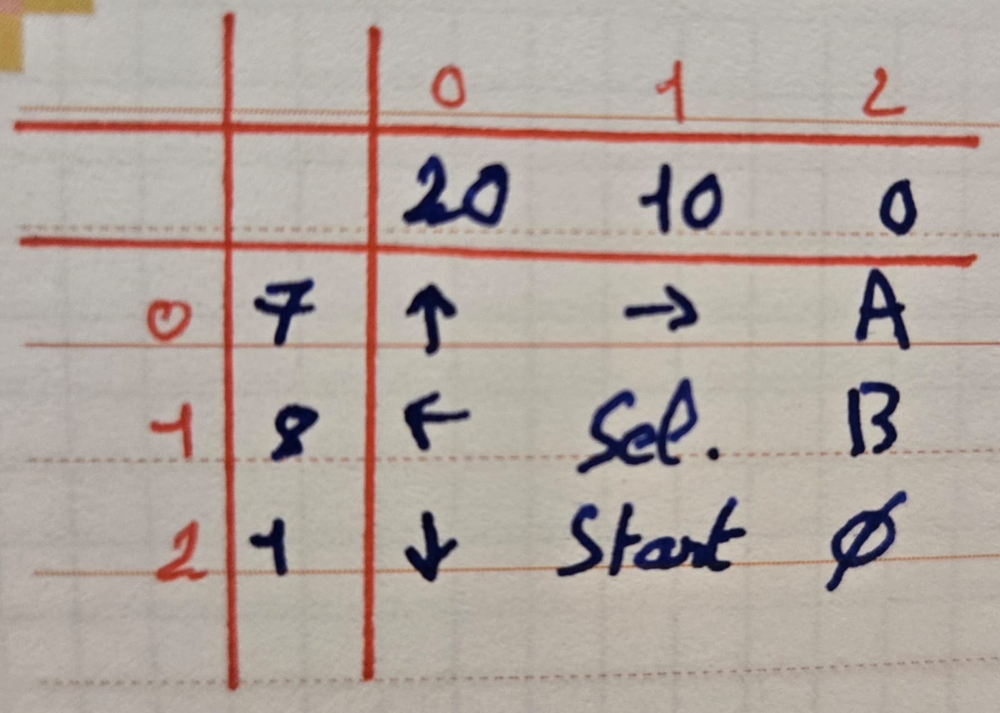
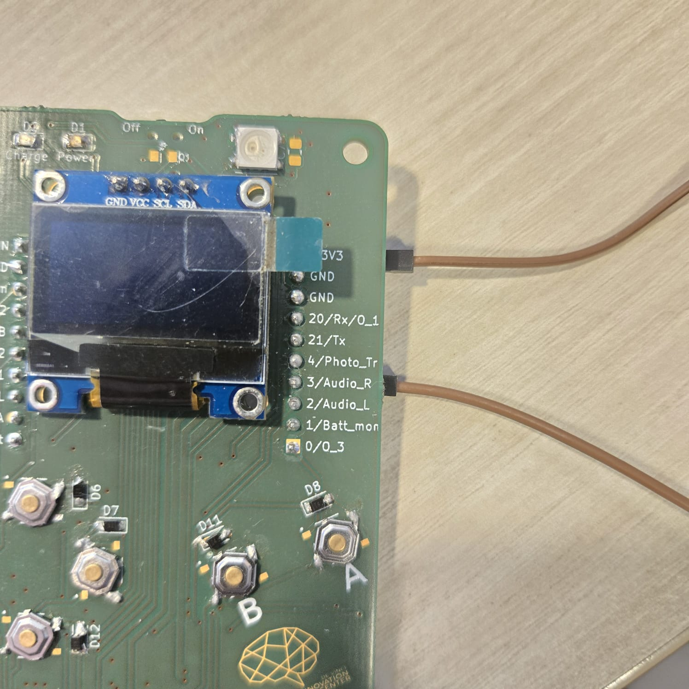

# ESPboy - Doc FR (EN After)
Ce programme utilise une carte ESP 32 pour gérer un jeu qui affiche des pixels sur un écran OLED, détecte les appuis de boutons pour interagir avec le jeu, et joue de la musique via un haut-parleur. Il comporte des fonctionnalités pour le mouvement du joueur, la gestion d'un combat, et la lecture de musique.  

Vidéo : https://github.com/Techartdr/game-espboy/blob/main/res/Demo.mp4

## 1. Bibliothèques Utilisées

#include <Adafruit_GFX.h>  
#include <Adafruit_SSD1306.h>  

Les bibliothèques Adafruit GFX et Adafruit SSD1306 sont utilisées pour contrôler l'écran OLED. La bibliothèque Adafruit_GFX fournit des fonctionnalités graphiques de base (lignes, cercles, texte), et Adafruit_SSD1306 permet de communiquer avec les écrans OLED basés sur le pilote SSD1306.

## 2. Définition des Constantes

#define SCREEN_WIDTH 128  
#define SCREEN_HEIGHT 64  
#define OLED_RESET -1  
#define SCREEN_ADDRESS 0x3C  

Ces constantes définissent les paramètres de l'écran OLED :  

SCREEN_WIDTH et SCREEN_HEIGHT spécifient les dimensions de l'écran.  
OLED_RESET est mis à -1, indiquant qu'aucune broche de réinitialisation n'est utilisée.  
SCREEN_ADDRESS est l'adresse I2C de l'écran.  

## 3. Déclaration de la Matrice de Boutons

const int ROW_PINS[] = {7, 8, 1};  
const int COL_PINS[] = {20, 10, 0};  

Les broches pour la matrice de boutons sont spécifiées. Les lignes et les colonnes correspondent aux broches de la carte Arduino où les boutons sont connectés.

Voici comment est configurée la matrice :  

## 4. Variables Globales pour l'Écran et le Jeu

Adafruit_SSD1306 display(SCREEN_WIDTH, SCREEN_HEIGHT, &Wire, OLED_RESET);  
int pixelX = SCREEN_WIDTH / 2;  
int pixelY = SCREEN_HEIGHT / 2;  
int enemyX = 10;  
int enemyY = 20;  

Ces variables gèrent les coordonnées du joueur et de l'ennemi sur l'écran OLED.

## 5. Variables pour la Gestion de la Musique et le Jeu

const int speakerPin = 3;  
unsigned long lastNoteTime = 0;  
int currentNote = 0;  

Les variables musicales gèrent la lecture des notes via un haut-parleur connecté à speakerPin. Elles incluent des listes de fréquences (notes) et de durées (durations) pour définir la musique jouée pendant le jeu.

Voici la connection entre le pin +3V3 et le pin signal Audio de la carte ESP 32 avec le haut parleur:  

## 6. Variables pour le Combat

int playerHealth = 10;  
int enemyHealth = 10;  
bool inCombat = false;  
bool gameEnded = false;  
bool playerWon = false;  

Ces variables permettent de suivre l'état de santé du joueur et de l'ennemi, ainsi que de savoir si le joueur est en combat et si le jeu est terminé.

## 7. Initialisation dans la Fonction setup()

void setup() {  
  Serial.begin(115200);  
  if (!display.begin(SSD1306_SWITCHCAPVCC, SCREEN_ADDRESS)) {  
    Serial.println(F("SSD1306 allocation failed"));  
    while (true);  
  }  
  display.clearDisplay();  
  drawPixel();  
  setupButtonMatrix();  
}  

Initialise la communication avec l'écran OLED et vérifie que tout fonctionne.  
Efface l'écran et configure la matrice de boutons pour détecter les appuis.  

## 8. Fonction loop() - Cycle Principal du Programme

La fonction loop() gère la logique principale du jeu :  

Jouer de la musique via playMusic().  
Contrôler le jeu selon l'état actuel (inCombat, gameEnded, etc.).  
Appeler d'autres fonctions pour gérer le combat ou le déplacement du joueur.  

## 9. Gestion de la Musique avec playMusic()

Cette fonction joue les notes de musique à des intervalles définis. Les notes sont jouées via le haut-parleur connecté.

## 10. Configuration et Gestion de la Matrice de Boutons

void setupButtonMatrix();  
void handleButtonPress();  
Ces fonctions configurent la matrice de boutons et détectent les appuis. Elles incluent une logique de "debounce" pour éviter les appuis multiples involontaires.

## 11. Fonctionnalités du Jeu

Mouvement du Joueur: movePixel(int row, int col) déplace le pixel (joueur) sur l'écran selon l'entrée des boutons.  
Détection de Combat: checkForCombat() vérifie si les coordonnées du joueur correspondent à celles de l'ennemi.  
Gestion du Combat: handleCombatInput(int row, int col), playerAttack(int attackType), et enemyTurn() gèrent les actions de combat entre le joueur et l'ennemi.  
Affichage: displayCombat() affiche l'état de santé pendant le combat, tandis que displayMessage(const char* msg) affiche des messages temporaires.  

## 12. Réinitialisation et Écran de Fin

void resetGame();  
void displayEndScreen();  

Ces fonctions réinitialisent les paramètres du jeu lorsque le joueur appuie sur un bouton après la fin du jeu. displayEndScreen() affiche une animation de victoire ou de défaite.  

## 13. Affichage Graphique: drawPixel()

void drawPixel() {  
  display.clearDisplay();  
  display.drawPixel(pixelX, pixelY, SSD1306_WHITE);  
  display.drawPixel(enemyX, enemyY, SSD1306_WHITE);  
  display.display();  
}  

Cette fonction dessine le joueur et l'ennemi sur l'écran OLED aux positions correspondantes.  

## Résumé

Ce code implémente un petit jeu sur Arduino qui :  

- Affiche un pixel représentant le joueur et un ennemi sur un écran OLED.  
- Permet au joueur de se déplacer via une matrice de boutons.  
- Active un combat si le joueur rencontre l'ennemi.  
- Joue de la musique en arrière-plan pendant que le joueur interagit avec le jeu.  
- Gère les animations de fin selon que le joueur gagne ou perd le combat.  
- Les fonctionnalités sont bien organisées avec des fonctions dédiées pour chaque partie, facilitant la lecture et la maintenance du code. Vous pouvez améliorer ce jeu en ajoutant des niveaux supplémentaires, de nouveaux ennemis, ou des sons plus complexes.  

# ESPboy - Doc EN

This program uses an Arduino board to manage a small game that displays graphics on an OLED screen, detects button presses to interact with the game, and plays music through a speaker. It includes features for player movement, combat management, and music playback.  

Video : https://github.com/Techartdr/game-espboy/blob/main/res/Demo.mp4

## 1. Libraries Used

#include <Adafruit_GFX.h>  
#include <Adafruit_SSD1306.h>  

The Adafruit GFX and Adafruit SSD1306 libraries are used to control the OLED display. The Adafruit_GFX library provides basic graphic functions (lines, circles, text), and Adafruit_SSD1306 enables communication with OLED screens based on the SSD1306 driver.

## 2. Constant Definitions

#define SCREEN_WIDTH 128  
#define SCREEN_HEIGHT 64  
#define OLED_RESET -1  
#define SCREEN_ADDRESS 0x3C  
These constants define the parameters of the OLED screen:  

SCREEN_WIDTH and SCREEN_HEIGHT specify the screen dimensions.  
OLED_RESET is set to -1, indicating that no reset pin is used.  
SCREEN_ADDRESS is the I2C address of the screen.  

## 3. Button Matrix Declaration

const int ROW_PINS[] = {7, 8, 1};  
const int COL_PINS[] = {20, 10, 0};  

Pins for the button matrix are specified. The rows and columns correspond to the pins on the Arduino board where the buttons are connected.  

This is how the matrix is configured:  

## 4. Global Variables for the Screen and Game

Adafruit_SSD1306 display(SCREEN_WIDTH, SCREEN_HEIGHT, &Wire, OLED_RESET);  
int pixelX = SCREEN_WIDTH / 2;  
int pixelY = SCREEN_HEIGHT / 2;  
int enemyX = 10;  
int enemyY = 20;  

These variables manage the coordinates of the player and the enemy on the OLED screen.  

## 5. Variables for Music and Game Management

const int speakerPin = 3;  
unsigned long lastNoteTime = 0;  
int currentNote = 0;  

Music variables handle note playback via a speaker connected to speakerPin. They include lists of frequencies (notes) and durations (durations) to define the music played during the game.  

Here's the connection between the +3V3 pin and the Audio signal pin on the ESP 32 board with speaker:  

## 6. Combat Variables

int playerHealth = 10;  
int enemyHealth = 10;  
bool inCombat = false;  
bool gameEnded = false;  
bool playerWon = false;  

These variables keep track of the player's and enemy's health, as well as whether the player is in combat and if the game has ended.  

## 7. Initialization in the setup() Function

void setup() {  
  Serial.begin(115200);  
  if (!display.begin(SSD1306_SWITCHCAPVCC, SCREEN_ADDRESS)) {  
    Serial.println(F("SSD1306 allocation failed"));  
    while (true);  
  }  
  display.clearDisplay();  
  drawPixel();  
  setupButtonMatrix();  
}  

Initializes communication with the OLED screen and checks that everything works.  
Clears the display and sets up the button matrix to detect presses.  

## 8. loop() Function - Main Program Cycle

The loop() function manages the game's main logic:  

Play music via playMusic().  
Control game flow based on the current state (inCombat, gameEnded, etc.).  
Call other functions to handle combat or player movement.  

## 9. Music Management with playMusic()

This function plays musical notes at defined intervals. Notes are played through the speaker connected to the board.  

## 10. Button Matrix Setup and Management

void setupButtonMatrix();  
void handleButtonPress();  

These functions configure the button matrix and detect presses. They include "debounce" logic to avoid unintentional multiple presses.  

## 11. Game Features

Player Movement: movePixel(int row, int col) moves the pixel (player) on the screen based on button input.  
Combat Detection: checkForCombat() checks if the player's coordinates match those of the enemy.  
Combat Management: handleCombatInput(int row, int col), playerAttack(int attackType), and enemyTurn() manage the combat actions between the player and the enemy.  
Display: displayCombat() shows the health status during combat, while displayMessage(const char* msg) displays temporary messages.  

## 12. Reset and End Screen
  
void resetGame();  
void displayEndScreen();  

These functions reset the game settings when the player presses a button after the game ends. displayEndScreen() shows an animation for winning or losing.  

## 13. Graphical Display: drawPixel()

void drawPixel() {  
  display.clearDisplay();  
  display.drawPixel(pixelX, pixelY, SSD1306_WHITE);  
  display.drawPixel(enemyX, enemyY, SSD1306_WHITE);  
  display.display();  
}  

This function draws the player and enemy on the OLED screen at the corresponding positions.  

## Summary

This code implements a small game on an Arduino that:  

- Displays a pixel representing the player and an enemy on an OLED screen.  
- Allows the player to move using a button matrix.  
- Initiates combat when the player encounters the enemy.  
- Plays background music while the player interacts with the game.  
- Manages end animations based on whether the player wins or loses the combat.  
- The features are well organized with dedicated functions for each part, making the code easy to read and maintain. You can enhance this game by adding extra levels, new enemies, or more complex sound effects.  